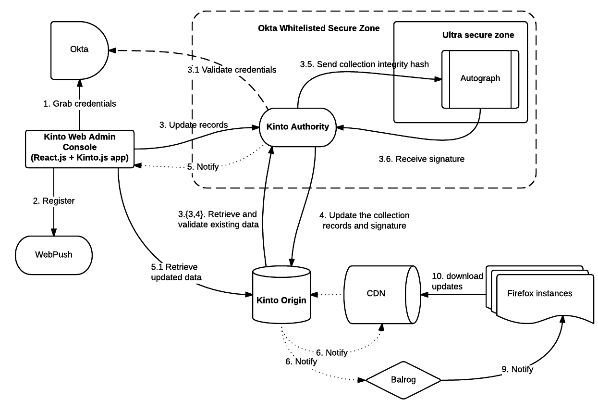

Kinto signer
#############

|travis|

.. |travis| image:: https://travis-ci.org/Kinto/kinto-signer.svg?branch=master
    :target: https://travis-ci.org/Kinto/kinto-signer

What does this do?
==================

**Kinto signer** is a `Kinto <https://kinto.readthedocs.org>`_ plugin that
makes it possible to sign the updates of Kinto collections. In other words,
it's a way to verify that the data the client has got is the data the original
authors intended to distribute.

This works with two Kinto instances:

- **A, the authority** (also known as "the signer"). It is where the original
  data are sent. The authority is configured to sign the data for a specific
  "origin".
- **O, the origin**, which will end up distributing the data and the signatures.
  It is where the client retrieve the data.

Triggering a signature on the authority
=======================================

Once started, the authority is behaving like a normal Kinto server, until you
ask for a signature of the collection. To trigger this signature operation,
you need to add a specific field on the **collection**: ``status: "to-sign"``.

Here is how to do it with ``httpie``:

.. code-block::

  echo '{"data": {"status": "to-sign"}}' | http PATCH http://0.0.0.0:8888/v1/buckets/default/collections/tasks --auth user:pass

From there, the authority will:

1. Retrieve all records on the collection, compute a hash of the records, and
   generate a signature out of it.
2. Send all local changes to the Origin server, **with a signature**.
3. Update the collection metadata with ``status:signed``.

Configuring kinto-signer
========================

To install this plugin in a Kinto server, a few configuration variables need
to be set.

Here is an example of what a configuration could look like:

.. code-block:: ini

  kinto.includes = kinto_signer

  kinto.signer.resources =
      source/collection1;destination/collection1
      source/collection2;destination/collection2

+---------------------------------+--------------------------------------------------------------------------+
| Setting name                    | What does it do?                                                         |
+=================================+==========================================================================+
| kinto.signer.resources          | The name of the buckets and collections on which signatures can be       |
|                                 | triggered and the destination where the data and the signatures will     |
|                                 | end-up.                                                                  |
+---------------------------------+--------------------------------------------------------------------------+
| kinto.signer.signer_backend     | The python dotted location to the signer to use. By default, a local     |
|                                 | ECDSA signer will be used. Choices are either                            |
|                                 | ``kinto_signer.signer.local_ecdsa`` or ``kinto_signer.signer.autograph`` |
|                                 | Have a look at the sections below for more information.                  |
+---------------------------------+--------------------------------------------------------------------------+

Configuration for the (default) ECDSA local signer
--------------------------------------------------

+---------------------------------+--------------------------------------------------------------------------+
| Setting name                    | What does it do?                                                         |
+=================================+==========================================================================+
| kinto.signer.ecdsa.private_key  | Absolute path to the ECDSA private key to use to apply the signatures    |
+---------------------------------+--------------------------------------------------------------------------+
| kinto.signer.ecdsa.public_key   | Absolute path to the ECDSA private key to use to verify the signature    |
|                                 | (useful if you just want to use the signer as a verifier)                |
+---------------------------------+--------------------------------------------------------------------------+

Configuration for the Autograph signer
--------------------------------------

Kinto signer can integrate with the
`Autograph <https://github.com/mozilla-services/autograph>`_ server. To do so,
use the following settings:

+------------------------------------+--------------------------------------------------------------------------+
| Setting name                       | What does it do?                                                         |
+====================================+==========================================================================+
| kinto.signer.autograph.server_url  | The autograph server URL                                                 |
+------------------------------------+--------------------------------------------------------------------------+
| kinto.signer.autograph.hawk_id     | The hawk identifier used to issue the requests.                          |
+------------------------------------+--------------------------------------------------------------------------+
| kinto.signer.autograph.hawk_secret | The hawk secret used to issue the requests.                              |
+------------------------------------+--------------------------------------------------------------------------+

Generating a keypair
====================

To generate a new keypair, you can use the following command::

  $ python -m kinto_signer.generate_keypair private.pem public.pem

Running the tests
=================
To run the unit tests::

  $ make tests

For the functional tests::

  $ make run-signer
  $ make functional
